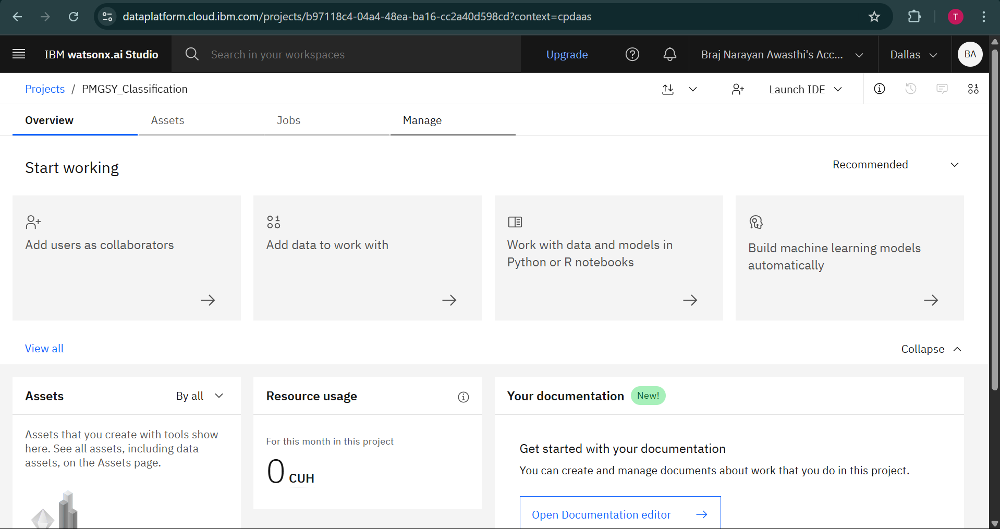
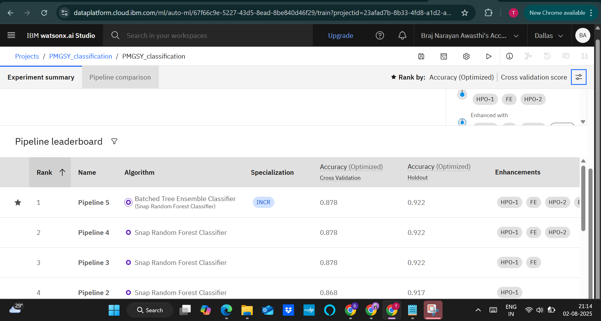
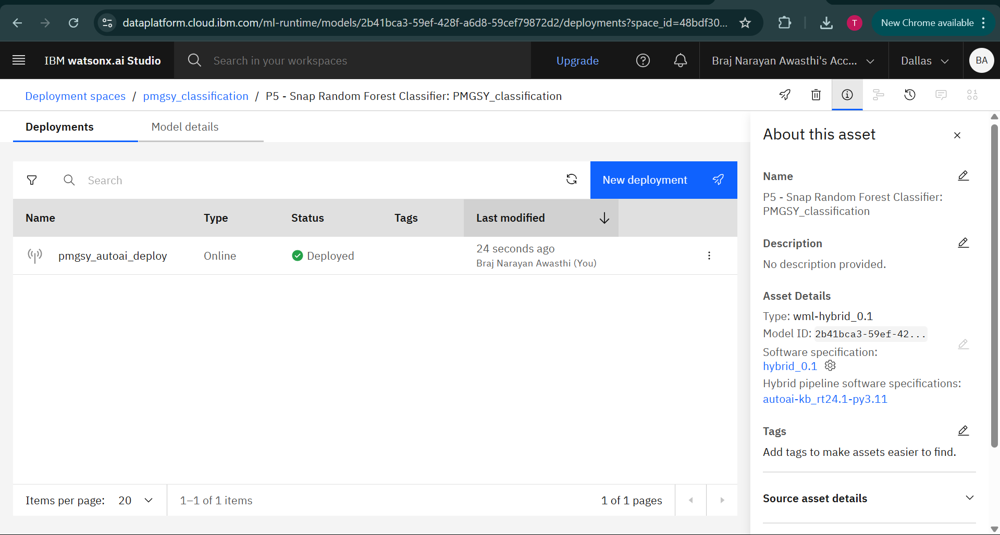
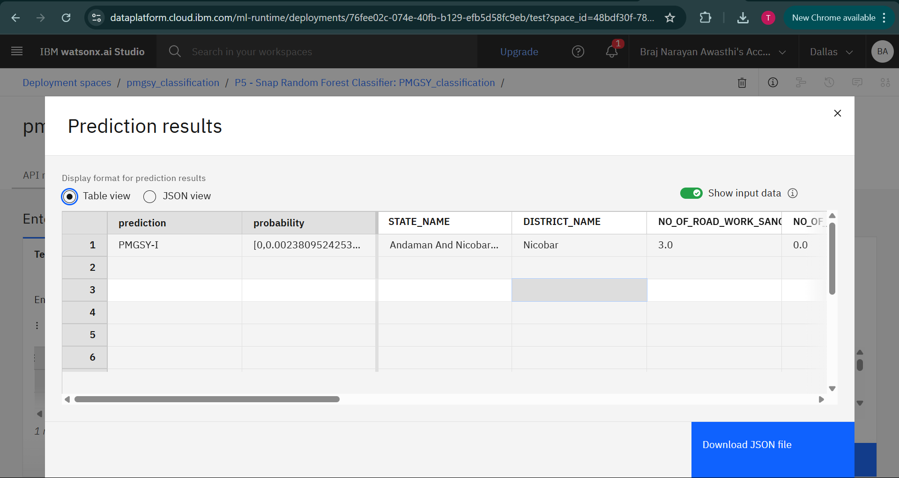
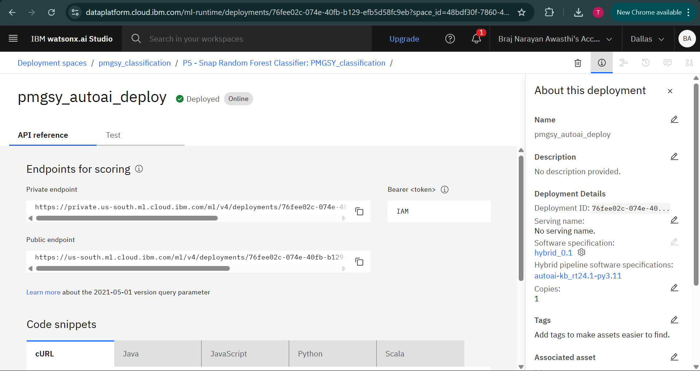
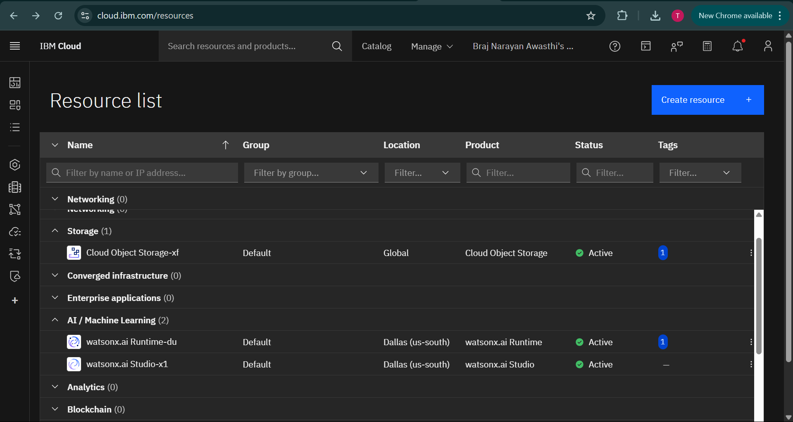

# 🛣️ Intelligent PMGSY Scheme Classifier using IBM Watsonx.ai

A Machine Learning-based solution that classifies rural infrastructure projects under the correct PMGSY scheme (PMGSY-I, PMGSY-II, PMGSY-III, PM-JANMAN, RCPLWEA) based on financial and physical attributes. Built using **IBM Watsonx.ai AutoAI** on **IBM Cloud Lite**.

---

## 🧩 Problem Statement

Government agencies struggle to manually classify thousands of rural road/bridge projects across multiple PMGSY schemes. Manual effort is time-consuming, error-prone, and unscalable. Accurate classification is essential for monitoring, fund allocation, and policy-making.

---

## 💡 Proposed Solution

An ML-based classification model built using IBM Watsonx.ai AutoAI that analyzes features like sanctioned cost, road length, expenditure, and completion metrics to accurately predict the scheme a project belongs to. This enables fast, transparent, and reliable classification.

---

## 🧠 Technologies Used

- IBM Watsonx.ai Studio  
- AutoAI (Model building and evaluation)  
- IBM Cloud Object Storage  
- Scikit-learn (via AutoAI pipeline)  
- Pandas, Matplotlib, PCA (Auto-generated)  
- IBM Cloud Lite account

---

## ☁️ IBM Cloud Services Used

- IBM Watsonx.ai Studio  
- AutoAI Runtime  
- IBM Cloud Object Storage  
- Deployment Endpoint via IBM Watsonx Runtime  
- IBM Cloud IAM (for secured access)

---

## 🧪 Key Features

- No-code ML model creation using AutoAI  
- High model accuracy (~92.2%)  
- REST API-based deployment using IBM Cloud  
- Auto feature selection, preprocessing, and PCA transformation  
- Built-in test UI for prediction verification  

---

## 📊 Dataset Information

- **Source:** [AI Kosh – PMGSY Dataset](https://aikosh.indiaai.gov.in/web/datasets/details/pradhan_mantri_gram_sadak_yojna_pmgsy.html)  
- **Records:** 230+  
- **Target Variable:** `PMGSY_SCHEME`  
- **Input Features:** 25+ (cost, works, bridges, road length, state, district)

---

## 🧠 Model Performance

- **Final Model:** `Snap Random Forest Classifier`  
- **Overall Accuracy:** ~92.2%  
- Strong performance across major scheme classes (PMGSY-I, II, III, PM-JANMAN)  
- Evaluation based on confusion matrix

---

## 🚀 How It Works

1. Data uploaded to IBM Watsonx.ai Studio project  
2. AutoAI automatically preprocesses, analyzes, and builds models  
3. Best model selected and evaluated  
4. Model deployed as REST API  
5. Predictions tested via built-in test UI  
6. Screenshots & notebook exported for documentation

---

## 🖼️ Screenshots
### 🔹 Setting up..

### 🔹 Model Leaderboard

### 🔹 Model Comparison

### 🔹 Deployment

### 🔹 Test Prediction Output

### 🔹 API References after Deployment...

### 🔹 Resources List...

---

## 🛣️ Future Scope

- Integrate the model into a real-time dashboard  
- Use custom ML pipelines for improved handling of imbalanced data  
- Explore model re-training with new incoming project data  
- Build a frontend (e.g., Streamlit) to accept user inputs for prediction  
- Enable region-wise analytics and reporting

---

## 🔗 Useful Links

- [IBM Cloud Lite](https://cloud.ibm.com/registration)  
- [IBM Watsonx.ai](https://www.ibm.com/products/watsonx-ai)  
- [AI Kosh – PMGSY Dataset](https://aikosh.indiaai.gov.in/web/datasets/details/pradhan_mantri_gram_sadak_yojna_pmgsy.html)  
- [Scikit-learn Documentation](https://scikit-learn.org/stable/)  
- [Pandas Documentation](https://pandas.pydata.org/docs/)

---
## ⚖️ License

This project is licensed under the [MIT License](LICENSE).

---

## 👨‍💻 Author

**Braj Narayan Awasthi**  
IBM SkillsBuild Intern – 2025  
[LinkedIn Profile](https://www.linkedin.com/in/braj-narayan-awasthi-33193a274)

---

> Created as part of the IBM SkillsBuild for Academia Internship 2025 using IBM Watsonx.ai

